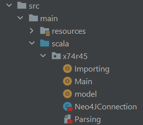
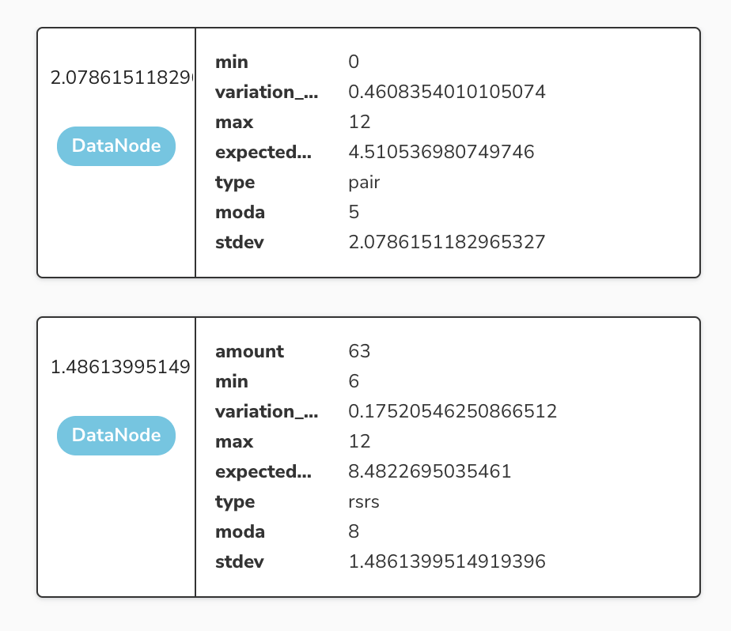
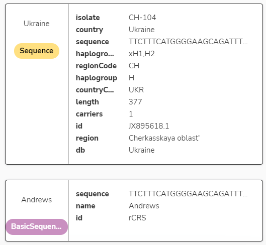
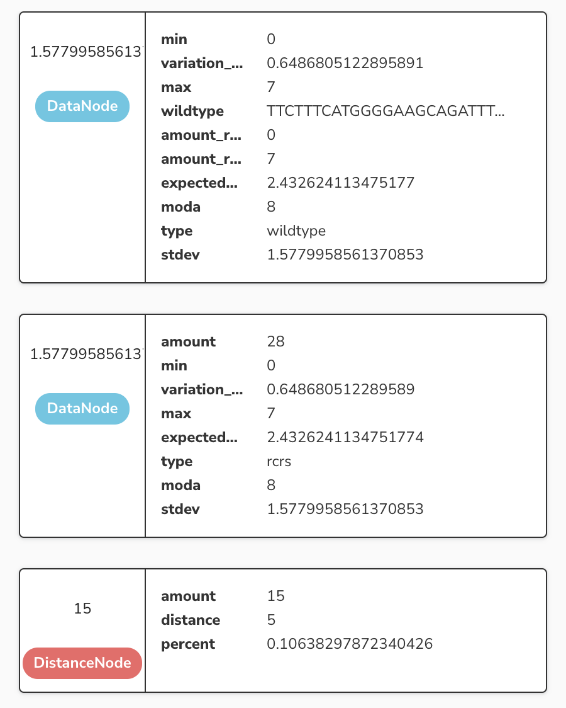
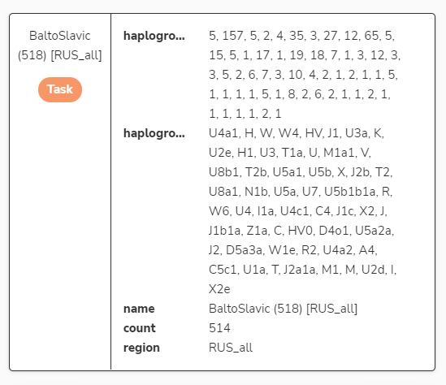
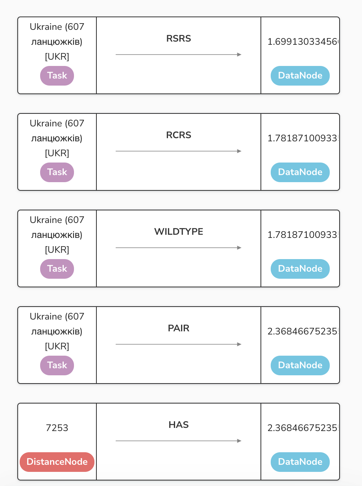
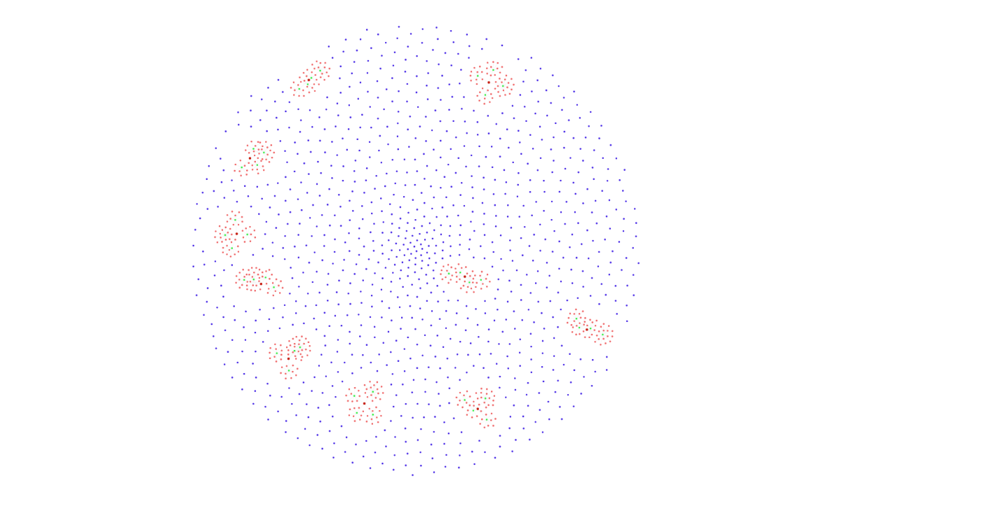
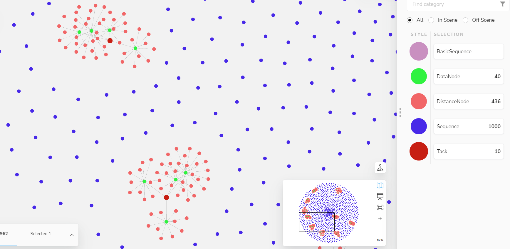

# mtDNA anylising with Neo4j tools

Data parsing and processing was done with [Data import script](https://github.com/74R45/NoSQL2022_Lab)

---
### НАЦІОНАЛЬНИЙ УНІВЕРСИТЕТ \"КИЄВО-МОГИЛЯНСЬКА АКАДЕМІЯ\"

ФАКУЛЬТЕТ ІНФОРМАТИКИ

Кафедра інформатики

{width="3.2708333333333335in"
height="2.3958333333333335in"}

> Лабораторна робота з дисципліни:
>
> «НЕРЕЛЯЦІЙНІ БАЗИ ДАНИХ»

на тему:

> «Аналіз ланцюжків мтДНК за допомогою Neo4j»
>
> Виконали:\
> Федюченко Михайло\
> Крещенко Тарас

**Зміст**

[1. Зони відповідальності розробників
[3](#зони-відповідальності-розробників)](#зони-відповідальності-розробників)

[2. Опис структури програми
[3](#опис-структури-програми)](#опис-структури-програми)

[3. Дані комп'ютера, на якому проводилися тести
[3](#дані-компютера-на-якому-проводилися-тести)](#дані-компютера-на-якому-проводилися-тести)

[4. Опис СКБД та результати роботи
[4](#опис-скбд-та-результати-роботи)](#опис-скбд-та-результати-роботи)

[4.1. Назва, версія [4](#назва-версія)](#назва-версія)

[4.2. Опис схеми бази даних
[4](#опис-схеми-бази-даних)](#опис-схеми-бази-даних)

[4.3. Переваги та недоліки обраної схеми
[6](#переваги-та-недоліки-обраної-схеми)](#переваги-та-недоліки-обраної-схеми)

[4.4. Запити до бази даних
[6](#запити-до-бази-даних)](#запити-до-бази-даних)

[4.5. Результати роботи [9](#результати-роботи)](#результати-роботи)

[4.6. Розмір БД на диску [10](#розмір-бд-на-диску)](#розмір-бд-на-диску)

[4.7. Час відпрацювання програми
[10](#час-відпрацювання-програми)](#час-відпрацювання-програми)

[5. Висновки [10](#висновки)](#висновки)

# Зони відповідальності розробників

+----------------------------------+-----------------------------------+
| Крещенко Тарас                   | -   Розробка структури БД         |
|                                  |                                   |
|                                  | -   Парсинг даних                 |
|                                  |                                   |
|                                  | -   Імпортування даних            |
|                                  |                                   |
|                                  | -   Проведення тестів на своїй    |
|                                  |     машині                        |
|                                  |                                   |
|                                  | -   Оформлення звіту              |
|                                  |                                   |
|                                  | -   Збір даних у .xlsx            |
+----------------------------------+-----------------------------------+
| Федюченко Михайло                | -   Розробка структури БД         |
|                                  |                                   |
|                                  | -   Написання запитів             |
|                                  |                                   |
|                                  | -   Проведення тестів на своїй    |
|                                  |     машині                        |
|                                  |                                   |
|                                  | -   Проведення аналізу даних      |
|                                  |                                   |
|                                  | -   Оформлення звіту              |
+----------------------------------+-----------------------------------+

# Опис структури програми

Лабораторну роботу виконано з використанням Neo4j. У якості середовища
розробки було використано мову Scala для парсингу даних та формування
запиту, що імпортує дані в Neo4j.

Код програми можна знайти за посиланням:
[[https://github.com/74R45/NoSQL2022_Lab]{.underline}](https://github.com/74R45/NoSQL2022_Lab)

*Структура Scala-програми*

Для виконання запитів та їх відладки був використаний Neo4j Browser, що
є засобом для керуванням графами. Для аналізу та візуалізації даних
використано Neo4j Bloom. Засобами Neo4j Browser було сформовано
універсальний шаблон для будь-якого завдання.

# Дані комп'ютера, на якому проводилися тести

-   HP ENVY x360 (2014)

    -   Processor: Intel Core i7-5500U @ 2.40GHz (4 CPUs)

    -   Memory: 16 GB RAM

    -   SSD 1 TB (WDS100T2B0A)

-   MacBook Pro (16-inch, 2019)

    -   Processor: 2.6 GHz 6-ядерний Intel Core i7

    -   Memory: 32 GB 2667 MHz DDR4

    -   SSD 500 GB (AP0512N)

4.  # Опис СКБД та результати роботи

    1.  # Назва, версія

В лабораторній роботі було використано Neo4j 4.4.5. (2 грудня 2021)

# Опис схеми бази даних

Neo4j не вимагає задання схеми бази даних, усі ноди були сформовані
автоматично на етапі імпортування, або під час створення завдань. На
діаграмах можна побачити ноди що беруть участь у формуванні графа
"Завдання". Кожне завдання має властивості: name, count, region.

{width="3.2916666666666665in"
height="2.846025809273841in"}{width="3.2042694663167106in"
height="2.9270833333333335in"}{width="3.380349956255468in"
height="4.212748250218723in"}

Оскільки для кожного завдання Task потрібно було зберігати додаткові
дані по розподілам, було вирішено створити ноди з міткою DataNode та
зв'язати відповідним зв'язком, що відповідає за вид інформації що
зберігає дана нода. Тобто чи це дані про розподіл відносно базової rsrs
чи rcrs, або ж розподіл відносно базового типу, попарний розподіл, або ж
гаплогрупи.{width="3.1166666666666667in"
height="2.6908923884514437in"}

Самі ж відстані зберігаються у нодах з міткою DistanceNode. З даними по
самій відстані, кількістю та часткою.

{width="3.563403324584427in"
height="4.781976159230096in"}

# Переваги та недоліки обраної схеми

Перевагою такої схеми є швидке формування статистичних даних та
використання графових алгоритмів для оптимізації запитів.

{width="5.339583333333334in"
height="3.0509733158355203in"}

{width="6.496527777777778in"
height="3.1694444444444443in"}

# Запити до бази даних

Створення завдання:

{width="5.493097112860893in"
height="1.8607830271216097in"}

RSRS DataNode:

{width="5.146274059492564in"
height="4.077412510936133in"}{width="5.132979002624672in"
height="5.379887357830271in"}

Wildtype DataNode:

{width="5.646454505686789in"
height="5.904784558180228in"}

{width="5.710936132983377in"
height="6.238991688538933in"}

{width="5.499937664041995in"
height="1.8290004374453193in"}

# Результати роботи

Див. results.xlsx.

# Розмір БД на диску

Загалом:

-   Empty DB: 253 442 025 bytes (241.7 MB)

-   After import: 255 200 262 bytes (243.38 MB) (+1.68 MB)

-   After analysis: 277 072 719 bytes (264.2 MB) (+22.5 MB)

Папка "data":

-   Empty DB: 1 921 801 bytes (1.83 MB)

-   After import: 3 591 120 bytes (3.42 MB) (+1.59 MB)

-   After analysis: 3 934 977 bytes (3.75 MB) (+1.92 MB)

    1.  # Час відпрацювання програми

Запити виконувалися за допомогою Neo4j Browser. Оскільки Query logging
доступне лише в версії Enterprise, то для заміру часу виконання запитів
було використано час, що відображається після виконання запиту в
графічному інтерфейсі:

{width="4.221321084864392in"
height="2.205194663167104in"}

Тобто, час виконання однієї задачі дорівнює сумі часів виконання всіх
підзапитів цієї задачі.

HP ENVY x360 (2014):

-   UKR (607): 11.46s

-   UKR_Karpatska (142): 6.86s

-   UKR_Tsenralno_ukr (410): 6.48s

-   BEL (260): 7.18s

-   RUS_all (516): 7.22s

-   RUS_south (293): 6.42s

-   RUS_north (223): 6.78s

-   UKR_CZ (701): 10.74s

-   UKR_BEL_RUS_all (1383): 20.91s

-   UKR_BEL_RUS_south (1160): 17.71s

MacBook Pro (16-inch, 2019):

-   UKR (607): 2.02s

-   UKR_Karpatska (142): 1.11s

-   UKR_Tsenralno_ukr (410): 3.47s

-   BEL (260): 2.85s

-   RUS_all (516): 2.41s

-   RUS_south (293): 1.05s

-   RUS_north (223): 1.23s

-   UKR_CZ (701): 2.32s

-   UKR_BEL_RUS_all (1383): 6.23s

-   UKR_BEL_RUS_south (1160): 4.14s

# Висновки

Базу даних Neo4j однозначно можна використовувати для задач такого типу.
Проведення статистики та аналізу даних є одним з варіантів використання
графових БД, тому виконання цієї задачі було доволі комфортним. В
результаті виконання даної лабораторної роботи були здобуті навички
побудови запитів мовою Cypher взаємодії з базою даних Neo4j. Також
вдалося закріпити навички розробки складних алгоритмічних функцій для
аналізу послідовностей ДНК.
